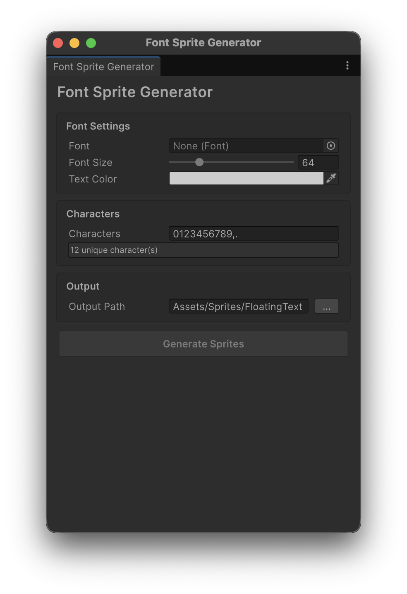

# Floating Text Render Feature

Unity URP(Universal Render Pipeline) 에서 동작하는 월드 스페이스 플로팅 텍스트 렌더링 패키지입니다. 

## Preview

https://github.com/user-attachments/assets/50299113-4016-4622-aca2-d44aedc3f65c


## Features

- **GPU Instanced Rendering** - 최소한의 렌더링 비용으로 수천개의 텍스트를 배치 렌더링.
- **Burst + Job System** - 텍스트 애니메이션을 JobSystem 병렬처리 및 버스트 컴파일. 
## Requirements

- Unity 6000.0+
- Universal Render Pipeline 17.0.0+
- Addressables 2.3.1+
- UniTask 2.5.10+
- Burst 1.8.18+
- Collections 2.5.1+

## Installation

Package Manager에 다음을 추가하세요.

- https://github.com/shlifedev/FloatingTextRenderFeature.git?path=

## Quick Start

1. **URP Renderer에 Feature 추가** - URP Renderer Asset의 Renderer Features에 `FloatingTextRenderFeature`를 추가합니다.
2. **FloatingTextManager 배치** - 씬에 빈 GameObject를 만들고 `FloatingTextManager` 컴포넌트를 추가합니다.
3. **스프라이트 준비** - Font Sprite Generator로 숫자 스프라이트를 생성합니다 (아래 참고).
4. **코드에서 호출**:

```csharp
FloatingTextManager.Instance.Show(worldPosition, damage);

// duration과 scale 지정
FloatingTextManager.Instance.Show(worldPosition, damage, duration: 1.0f, scale: 1.5f);
```

## Font Sprite Generator

`Window > Floating Text > Font Sprite Generator` 메뉴에서 접근할 수 있는 에디터 도구입니다.

폰트 파일에서 숫자(0-9) 및 기호(,.) 이미지를 개별 PNG 스프라이트로 추출하고, 자동으로 Addressables 그룹에 등록합니다.




**사용 방법:**
1. **Font** - 사용할 폰트 파일을 지정합니다
2. **Font Size** - 출력 스프라이트의 크기를 조절합니다
3. **Text Color** - 텍스트 색상을 설정합니다
4. **Characters** - 생성할 문자를 입력합니다 (기본값: `0123456789,.`)
5. **Output Path** - 스프라이트가 저장될 경로를 지정합니다
6. **Generate Sprites** 버튼을 클릭하면 스프라이트가 생성되고 Addressables에 자동 등록됩니다


### 별도 폰트 이미지를 사용하려는 경우

위 도구를 이용해서 스프라이트를 만든 뒤 자신의 이미지로 교체하세요.

### 스프라이트 아틀라스

현재는 아틀라스 미지원. 따라서 123456789 라는 텍스트를 렌더링시 배칭이 9 증가합니다.


 
## License

MIT
